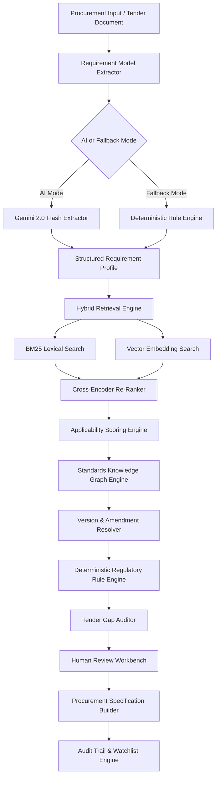

# MANAK System Architecture & Technical Specification

## System Overview

MANAK is a hybrid neuro-symbolic procurement intelligence application designed to process unstructured requirement descriptions and tender documents into evidence-backed, version-aware standards recommendations and technical specifications.

## Component Architecture

### 1. Requirements Extraction Engine (`backend/app/services/ai/extraction.py`)
Extracts structured Pydantic schemas (`product`, `category`, `application`, `environment`, `attributes`, `performance_requirements`, `testing_requirements`, `safety_requirements`, `materials`, `quantities`, `mentioned_standards`, `regulatory_clues`).

### 2. Hybrid Retrieval Pipeline (`backend/app/services/retrieval/`)
Combines BM25 scoring with dense vector cosine similarity (using pgvector embeddings). Results are re-ranked using a cross-encoder model.

### 3. Standards Knowledge Graph (`backend/app/services/graph/`)
Stores and queries relationship edges (`PRIMARY_PRODUCT_STANDARD`, `ALLIED_STANDARD`, `NORMATIVE_REFERENCE`, `TEST_METHOD`, `SAFETY_STANDARD`, `TERMINOLOGY_STANDARD`, `INSTALLATION_STANDARD`, `MATERIAL_STANDARD`, `GOVERNED_BY_QCO`, `AMENDED_BY`, `SUPERSEDES`).

### 4. Deterministic Regulatory Engine (`backend/app/services/regulatory/`)
Rule-based evaluation matching products, HS codes, and domain attributes against active Quality Control Orders (QCOs) and BIS mandatory certification schemes. LLM is strictly forbidden from inferring mandatory regulatory compliance.

### 5. Tender Auditor (`backend/app/services/audit/`)
Parses PDF/DOCX/TXT files, extracts existing claims/references, maps requirements against standard scopes, and flags missing standards, outdated references, testing gaps, and ambiguous phrasing.
